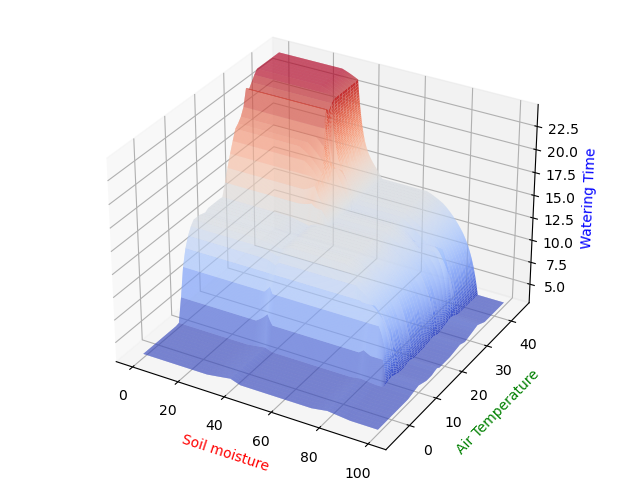

# Getting started

This program is written fully in Python. Necessary packages are listed in `packages.txt`. If you use conda as python package and environment manager, install required packages by running the following command in your terminal.

```
conda create --name <env> --file packages.txt
```

## Programs

- Member functions are defined in `memberFunction.py`, run this file to see the member function graph.
- Run `defuzzification.py` to test the control system by enter air temp. and air moisture. Enter "exit" to leave the control system. Fuzzy rules are defined here.
- Run `drawSurface.py` to check out the performance graph.

## Member function


## Rules

|        | close | medium |  far   |
|--------|-------|--------|--------|
| dry    | short |  short   | medium |
| medium |medium | medium |  long  |
| wet    |medium |   long  |  long  |

## Performance surface



# Problem 2 

## (1)-without hidden layer
| Epoch |    | Desired Output | Initial Weight |        | Actual Output | Error e | Final Weight |        |
|-------|----|----------------|----------------|--------|---------------|---------|--------------|--------|
| X1    | X2 |                | W11            | W12    |               |         | W11          | W12    |
| -1    | -1 | 0              | 1              | -1     | 0             | 0       | 1            | -1     |
| -1    | 1  | 1              | 1              | -1     | -2            | 3       | 0.7          | -1     |
| 1     | -1 | 1              | 0.7            | -1     | 1.7           | -0.7    | 0.7          | -1.07  |
| 1     | 1  | 0              | 0.7            | -1.07  | -0.37         | 0.37    | 0.663        | -1.107 |
| -1    | -1 | 0              | 0.663          | -1.107 | 0.444         | -0.444  | 0.6186       | -1.151 |
| -1    | 1  | 1              | 0.6186         | -1.151 | -1.77         | 2.77    | 0.8956       | -1.151 |
| 1     | -1 | 1              | 0.8956         | -1.151 | 2.047         | -1.047  | 0.8956       | -1.256 |
| 1     | 1  | 0              | 0.8956         | -1.256 | -0.361        | 0.3605  | 0.8596       | -1.292 |

## (2)-with hidden layer
### Network 1
| inputs |    | Desired |   w31   |   w32   |   w41   |   w42   |   w53   |    w54   |    θ3   |    θ4   |    θ5   |    n3   |    n4   |    n5    |  f(n3)  |  f(n4)  |  f(n5) |  f*(n3)  |  f*(n4)  |  f*(n5)  | Actual Output |     Error    |    w31    |   w32   |   w41   |   w42   |   w53   |     w54     |    θ3    |    θ4   |    θ5   |
|:------:|:--:|:-------:|:-------:|:-------:|:-------:|:-------:|:-------:|:--------:|:-------:|:-------:|:-------:|:-------:|:-------:|:--------:|:-------:|:-------:|:------:|:--------:|:--------:|:--------:|:-------------:|:------------:|:---------:|:-------:|:-------:|:-------:|:-------:|:-----------:|:--------:|:-------:|:-------:|
|   -1   | -1 |    -1   |   0.2   |   -0.4  |   0.2   |   -0.2  |   0.1   |   -0.4   |   0.8   |   -0.1  |   0.3   |   -0.6  |   0.1   | -0.37687 | 0.35434 | 0.52498 | 0.4069 | 0.228784 | 0.249376 | 0.241329 |  -0.376871992 |  0.623128008 | 0.1857438 | -0.4046 | 0.20976 | -0.2016 | 0.10502 | -0.39960985 | 0.785744 | -0.1046 | 0.30976 |
|   -1   |  1 |    1    | 0.18574 | -0.4046 | 0.20976 | -0.2016 | 0.10502 | -0.39961 | 0.78574 | -0.1046 | 0.30976 | -1.3761 | -0.3067 | -0.39045 | 0.20163 | 0.42392 | 0.4036 | 0.160977 | 0.244211 | 0.240709 |  -0.390447686 | -1.390447686 | 0.2081268 | -0.3995 | 0.20015 |  -0.203 |  0.0936 |  -0.3992012 | 0.808127 | -0.1097 | 0.31938 |
|    1   | -1 |    1    | 0.20813 | -0.3995 | 0.20015 |  -0.203 |  0.0936 |  -0.3992 | 0.80813 | -0.1097 | 0.31938 | -0.2005 | 0.51289 | -0.38973 | 0.45005 | 0.62548 | 0.4038 | 0.247505 | 0.234254 | 0.240742 |  -0.389729891 | -1.389729891 | 0.1737303 | -0.4036 | 0.19043 | -0.2046 | 0.08224 | -0.39891524 | 0.842523 | -0.1138 |  0.3291 |
|    1   |  1 |    -1   | 0.17373 | -0.4036 | 0.19043 | -0.2046 | 0.08224 | -0.39892 | 0.84252 | -0.1138 |  0.3291 | -1.0724 | 0.09964 | -0.41296 | 0.25494 | 0.52489 | 0.3982 | 0.189948 | 0.249381 | 0.239637 |  -0.412959276 |  0.587040724 |  0.184881 |  -0.399 | 0.19999 |  -0.206 | 0.08712 |  -0.3986085 | 0.831373 | -0.1184 | 0.33866 |

### Network 2
| inputs |    | Desired |    w31   |    w32   |    w41   |    w42   |    w43   | w54 |    θ3    |    θ4    | θ5 |    n3    |    n4    | n5 |  f(n3)  |  f(n4)  | f(n5) |  f*(n3)  |  f*(n4)  | f*(n5) | Actual Output |     Error    |     w31    |    w32   |    w41   |    w42   |    w43   | w54 |     θ3     |    θ4    | θ5 |
|:------:|:--:|:-------:|:--------:|:--------:|:--------:|:--------:|:--------:|:---:|:--------:|:--------:|:--:|:--------:|:--------:|:--:|:-------:|:-------:|:-----:|:--------:|:--------:|:------:|:-------------:|:------------:|:----------:|:--------:|:--------:|:--------:|:--------:|:---:|:----------:|:--------:|:--:|
|   -1   | -1 |    -1   | 0.2      | -0.4     | 0.2      | -0.2     | -0.4     |     | 0.8      | 0.3      |    | -0.6     | -0.06    |    | 0.35434 |  0.485  |       | 0.228784 | 0.249775 |        | -0.06         | 0.94         | 0.17849428 | -0.42151 | 0.176521 | -0.22348 | -0.41409 |     | 0.77849428 | 0.276521 |    |
|   -1   |  1 |    1    | 0.178494 | -0.42151 | 0.176521 | -0.22348 | -0.41409 |     | 0.778494 | 0.276521 |    | -1.37849 | -0.1057  |    | 0.20125 |  0.4736 |       | 0.160749 | 0.249303 |        | -0.105704138  | -1.105704138 | 0.19626836 | -0.43928 | 0.204087 | -0.25104 | -0.37609 |     | 0.79626836 | 0.304087 |    |
|    1   | -1 |    1    | 0.196268 | -0.43928 | 0.204087 | -0.25104 | -0.37609 |     | 0.796268 | 0.304087 |    | -0.16072 | 0.211489 |    | 0.45991 | 0.55268 |       | 0.248392 | 0.247225 |        | 0.211489395   | -0.788510605 | 0.17668235 | -0.41969 | 0.184593 | -0.23155 | -0.37296 |     | 0.81585438 | 0.323581 |    |
|    1   |  1 |    -1   | 0.176682 | -0.41969 | 0.184593 | -0.23155 | -0.37296 |     | 0.815854 | 0.323581 |    | -1.05887 | 0.024371 |    | 0.25753 | 0.50609 |       | 0.191206 | 0.249963 |        | 0.024371267   | 1.024371267  | 0.196269   | -0.40011 | 0.210198 | -0.20594 | -0.40007 |     | 0.79626773 | 0.297975 |    |