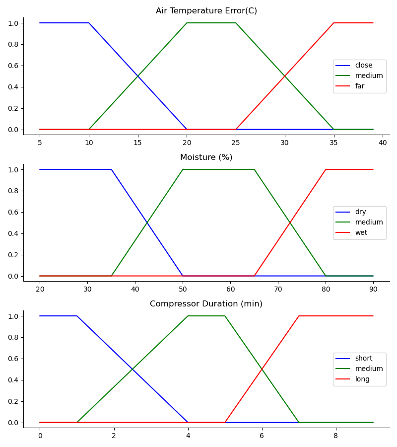

# Getting started
This program is written fully in Python. Necessary packages are listed in `packages.txt`. If you use conda as python package and environment manager, install required packages by running the following command in your terminal.
```
$ conda create --name <env> --file packages.txt
```

## Programs
- Member functions are defined in `memberFunction.py`, run this file to see the member function graph.
- Run `defuzzification.py` to test the control system by enter air temp. and soil moisture. Enter "exit" to leave the control system.
- Run `drawSurface.py` to check out the performance graph. 

# The initial settings
## Member function


## Some case test
### Extreme end of universe:
At the extreme end the time seems to go to the same value of ~2.8.
- Temp: -5, Soil: 0
    - Time: 2.8000000145037967
- Temp: -5, Soil: 100
    - Time: 2.8000000145037967
- Temp: 45, Soil: 0
    - Time: 24.55555552181113
- Temp: 45, Soil: 100
    - Time: 2.8000000145037967
### Extreme end of each MF:
Watering time seems wiredly low at end of MFs.
- Temp: 10, Soil: 50
    - Time: 3.523809523809524
- Temp: 8, Soil: 50
    - Time: 3.4352941244359383
- Temp: 20, Soil: 17
    - Time: 12.499999999999998
- Temp: 32, Soil: 100
    - Time: 3.187096760318533
- Temp: 35, Soil: 66
    - Time: 12.44622626691289

### MF overlaps: 
It seems like the system hesitate to raise watering time too much.
- Temp: 9, Soil: 30
    - Time: 11.104804798990116
- Temp: 19, Soil: 74
    - Time: 10.353458111049935
- Temp: 27, Soil: 30
    - Time: 17.0306432075052

## Performance surface
